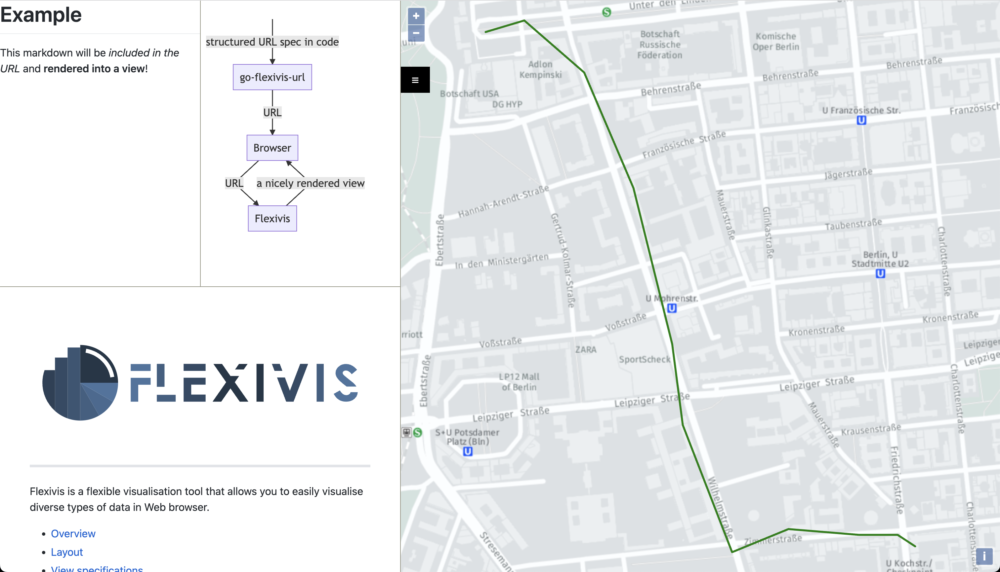

go-flexivis-url
===============

go-flexivis-url is a [Go](https://go.dev/) library for programatically constructing [Flexivis](https://flexivis.infrastruktur.link/) URLs.
It's very handy to use in tests writen in Go to generate rich output when a test fails that allows you to visualise the test case and what went wrong.

You can get it like this:
```bash
go get go-flexivis-url
```

And use it like this:
```go
package main

import (
	"encoding/json"

	"github.com/softwaretechnik-berlin/go-flexivis-url"
)

const someMarkdown = `
# Example

This markdown will be _included in the URL_ and **rendered into a view**!
`

func main() {
	println(flexivis.URL(
		flexivis.SideBySide{
			flexivis.VerticalStack{
				flexivis.SideBySide{
					flexivis.Markdown("description", flexivis.Inline(someMarkdown)),
					flexivis.Mermaid("diagram", flexivis.Inline(`graph TD; classDef empty stroke:none,fill:none; S( ):::empty -->|structured URL spec in code| G[go-flexivis-url] -->|URL| B[Browser] -->|URL| F[Flexivis] -->|a nicely rendered view| B`)),
				},
				flexivis.IFrame("flexivis", "https://flexivis.infrastruktur.link/"),
			}.OccupyingPercentage(40),
			flexivis.Map("a", flexivis.Inline(
				asJson(jobject{
					"type": "Feature",
					"geometry": jobject{
						"type": "LineString",
						"coordinates": []any{
							[]any{13.3907, 52.5074},
							[]any{13.3902, 52.5076},
							[]any{13.3891, 52.5076},
							[]any{13.3871, 52.5077},
							[]any{13.3855, 52.5073},
							[]any{13.3841, 52.5095},
							[]any{13.3838, 52.5109},
							[]any{13.3827, 52.5136},
							[]any{13.3813, 52.5156},
							[]any{13.3796, 52.5165},
							[]any{13.3785, 52.5163},
						},
					},
					"properties": jobject{
						"stroke":      "green",
						"id":          42,
						"title":       "Berlin Walk",
						"description": "Represents GPS data collected during a hypothetical walk through Berlin.",
						"source":      "handcrafted",
					},
				}),
			)),
		},
	))
}

type jobject = map[string]any

func asJson(value any) string {
	j, err := json.Marshal(value)
	if err != nil {
		panic(err)
	}
	return string(j)
}
```

The program above will output the following URL:
```url
https://flexivis.infrastruktur.link#layout=((description/diagram)-flexivis)40/a&description=md:inline:%0A%23+Example%0A%0AThis+markdown+will+be+_included+in+the+URL_+and+**rendered+into+a+view**!%0A&diagram=mermaid:inline:graph+TD;+classDef+empty+stroke:none,fill:none;+S(+):::empty+--%3E%7Cstructured+URL+spec+in+code%7C+G[go-flexivis-url]+--%3E%7CURL%7C+B[Browser]+--%3E%7CURL%7C+F[Flexivis]+--%3E%7Ca+nicely+rendered+view%7C+B&flexivis=https://flexivis.infrastruktur.link/&a=map:inline:%7B%22geometry%22:%7B%22coordinates%22:[[13.3907,52.5074],[13.3902,52.5076],[13.3891,52.5076],[13.3871,52.5077],[13.3855,52.5073],[13.3841,52.5095],[13.3838,52.5109],[13.3827,52.5136],[13.3813,52.5156],[13.3796,52.5165],[13.3785,52.5163]],%22type%22:%22LineString%22%7D,%22properties%22:%7B%22description%22:%22Represents+GPS+data+collected+during+a+hypothetical+walk+through+Berlin.%22,%22id%22:42,%22source%22:%22handcrafted%22,%22stroke%22:%22green%22,%22title%22:%22Berlin+Walk%22%7D,%22type%22:%22Feature%22%7D
```
<a href="https://flexivis.infrastruktur.link#layout=((description/diagram)-flexivis)40/a&description=md:inline:%0A%23+Example%0A%0AThis+markdown+will+be+_included+in+the+URL_+and+**rendered+into+a+view**!%0A&diagram=mermaid:inline:graph+TD;+classDef+empty+stroke:none,fill:none;+S(+):::empty+--%3E%7Cstructured+URL+spec+in+code%7C+G[go-flexivis-url]+--%3E%7CURL%7C+B[Browser]+--%3E%7CURL%7C+F[Flexivis]+--%3E%7Ca+nicely+rendered+view%7C+B&flexivis=https://flexivis.infrastruktur.link/&a=map:inline:%7B%22geometry%22:%7B%22coordinates%22:[[13.3907,52.5074],[13.3902,52.5076],[13.3891,52.5076],[13.3871,52.5077],[13.3855,52.5073],[13.3841,52.5095],[13.3838,52.5109],[13.3827,52.5136],[13.3813,52.5156],[13.3796,52.5165],[13.3785,52.5163]],%22type%22:%22LineString%22%7D,%22properties%22:%7B%22description%22:%22Represents+GPS+data+collected+during+a+hypothetical+walk+through+Berlin.%22,%22id%22:42,%22source%22:%22handcrafted%22,%22stroke%22:%22green%22,%22title%22:%22Berlin+Walk%22%7D,%22type%22:%22Feature%22%7D">
Which uses Flexivis to render the data in your browser:


</a>
